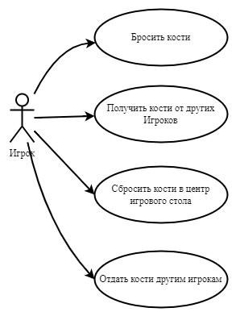

**Прецедент «Наблюдение за игрой»**

| Описание             | Игрок наблюдает за ходами других игроков |
|----------------------|------------------------------------------|
| Основной исполнитель | Игрок                                    |

**Основной сценарий:**

| **Действие игрока**                  | **Реакция системы**                                                                   |
|--------------------------------------|---------------------------------------------------------------------------------------|
| 1\. Получить кубики от Игрока справа | Добавить к количеству кубиков Игрока столько, сколько выпало «двоек» у игрока справа  |
| 2\. Получить кубики от Игрока слева  | Добавить к количеству кубиков Игрока столько, сколько выпало «пятерок» у игрока слева |

**Альтернативные сценарии:**

1а Если «двойки» не выпали у Игрока справа

> 1\. Ничего не происходит

2а Если «пятерки» не выпали у Игрока слева

> 1\. Ничего не происходит

**Прецедент «Бросание кубиков»**

| Описание             | Игрок в свой ход бросает кубики                                              |
|----------------------|------------------------------------------------------------------------------|
| Основной исполнитель | Игрок                                                                        |
| Предусловие          | Наличие кубиков у игрока                                                     |
| Постусловие          | Отсутствие кубиков или прекращение выпадения «единиц», «двоек» или «пятерок» |

**Основной сценарий:**

| **Действие Игрока**      | **Реакция системы**                                                            |
|--------------------------|--------------------------------------------------------------------------------|
| 1\. Игрок бросает кубики | Уменьшить количество костей у Игрока на столько, сколько выпало «единиц»       |
|                          | Увеличить количество костей в центре стола на столько, сколько выпало «единиц» |
| *2. Повторение пункта 1* | Предлагать бросить кубик столько раз, сколько необходимо по результатам        |
| *3.* Игрок завершает ход | Ход передается следующему игроку                                               |

**Альтернативные сценарии:**

1а Если на костях выпали «двойки»

> 1\. Уменьшить количество костей у Игрока на столько, сколько выпало
> «двоек»
>
> 2\. Увеличить количество костей у игрока слева на столько, сколько
> выпало «двоек»

1б Если на костях выпали «пятерки»

> 1\. Уменьшить количество костей у Игрока на столько, сколько выпало
> «пятерок»
>
> 2\. Увеличить количество костей у игрока справа на столько, сколько
> выпало «пятерок»

1в Если на костях не выпали «двойки», «единицы» и «пятерки»

> 1\. Перейти к пункту 3

1г Если у Игрока закончились кубики

> 1\. Перейти к пункту 3

1д Если Игрок выбросил на последней кости среди всех игроков «единицу»

> 1\. Объявить Игрока победителем
>
> 2\. Завершить работу системы

**Прецедент «Определение очередности хода»**

| Описание             | Путем бросания кубика определяется, каким по счету будет ходить Игрок |
|----------------------|-----------------------------------------------------------------------|
| Основной исполнитель | Игрок                                                                 |
| Предусловие          | Наличие костей у Игрока                                               |
| Постусловие          | Определен номер очередности хода                                      |

**Основной сценарий:**

| Действие Игрока                                                 | Реакция системы                                                                              |
|-----------------------------------------------------------------|----------------------------------------------------------------------------------------------|
| 1\. Игрок бросает кости                                         | Запоминает выпавшее число                                                                    |
| 2\. Игрок ожидает хода других игроков                           | Запоминает выпавшие числа других игроков                                                     |
|                                                                 | Определить очередность хода: игрок с наибольшим значением – первый, с наименьшим - последний |
| 3\. Игрок садится за стол в зависимости от его очередности хода |                                                                                              |

**Альтернативные сценарии:**

2а Если у игроков выпало одинаковое значение на костях

> 1\. Предложить каждому игроку перебросить кости
