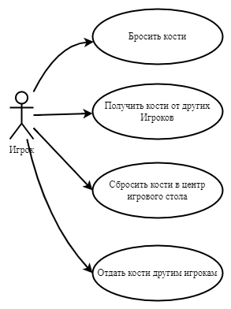

**Прецедент «Получить кости от других игроков»**

| Описание             | Игрок может получить кости от других игроков в любой момент игры |
|----------------------|------------------------------------------------------------------|
| Основной исполнитель | Игрок                                                            |

**Основной сценарий:**

| **Действие игрока**                  | **Реакция системы**                                                                   |
|--------------------------------------|---------------------------------------------------------------------------------------|
| 1\. Получить кубики от Игрока справа | Добавить к количеству кубиков Игрока столько, сколько выпало «двоек» у игрока справа  |
| 2\. Получить кубики от Игрока слева  | Добавить к количеству кубиков Игрока столько, сколько выпало «пятерок» у игрока слева |

**Альтернативные сценарии:**

1а Если «двойки» не выпали у Игрока справа

> 1\. Ничего не происходит

2а Если «пятерки» не выпали у Игрока слева

> 1\. Ничего не происходит

**Прецедент «Бросить кости»**

| Описание             | Игрок в свой ход бросает кубики                                              |
|----------------------|------------------------------------------------------------------------------|
| Основной исполнитель | Игрок                                                                        |
| Предусловие          | Наличие костей у игрока                                                     |
| Постусловие          | Отсутствие костей или прекращение выпадения «единиц», «двоек» или «пятерок» |

**Основной сценарий:**

| **Действие Игрока**      | **Реакция системы**                    |
|--------------------------|----------------------------------------|
| 1\. Игрок бросает кости | Система предлагает снова бросить кости |
| *2. Повторение пункта 1* |                                        |
| *3.* Игрок завершает ход | Ход передается следующему игроку       |

**Альтернативные сценарии:**

1а Если на костях не выпали «двойки», «единицы» и «пятерки»

> 1\. Перейти к пункту 3

1б Если у Игрока закончились кубики

> 1\. Перейти к пункту 3

**Прецедент «Отдать кости другим Игрокам»**

| Описание             | В зависимости от того, что выпало игроку в его ход на костях, происходят определенные действия |
|----------------------|------------------------------------------------------------------------------------------------|
| Основной исполнитель | Игрок                                                                                          |
| Предусловие          | На костях выпали «двойки», «пятерки»                                                           |
| Постусловие          | В выпавшей комбинации не осталось «двоек» и «пятерок»                                          |

**Основной сценарий:**

| Действие Игрока                             | Реакция системы                                                                  |
|---------------------------------------------|----------------------------------------------------------------------------------|
| 1\. Игрок выбросил комбинацию с «двойками»  | Уменьшить количество костей у Игрока на столько, сколько выпало «двоек»          |
|                                             | Увеличить количество костей у игрока слева на столько, сколько выпало «двоек»    |

**Альтернативные сценарии:**

1а Если Игрок выбросил комбинацию с «пятерками»

> 1\. Уменьшить количество костей у Игрока на столько, сколько выпало «пятерок»
> 2\. Увеличить количество костей у игрока слева на столько, сколько выпало «пятерок»

**Прецедент «Сбросить кости в центр игрового стола»**

| Описание             | Если в комбинации игрока присутствуют «единицы», происходит взаимодействие с игровым столом |
|----------------------|---------------------------------------------------------------------------------------------|
| Основной исполнитель | Игрок                                                                                       |
| Предусловие          | На костях выпали «единицы»                                                                  |
| Постусловие          | В выпавшей комбинации не осталось «единиц»                                                  |

**Основной сценарий:**

| Действие Игрока                             | Реакция системы                                                                         |
|---------------------------------------------|-----------------------------------------------------------------------------------------|
| 1\. Игрок выбросил комбинацию с «единицами» | Уменьшить количество костей у Игрока на столько, сколько выпало «единиц»                |
|                                             | Увеличить количество костей в центре игрового стола на столько, сколько выпало «единиц» |

**Альтернативные сценарии:**

1а Если у игрока закончились кости

> 1\. Ход переходит к следующему игроку

1б Если игрок выбросил «единицу» на последней кости среди всех игроков

> 1\. Объявить Игрока победителем
>
> 2\. Завершить работу системы
