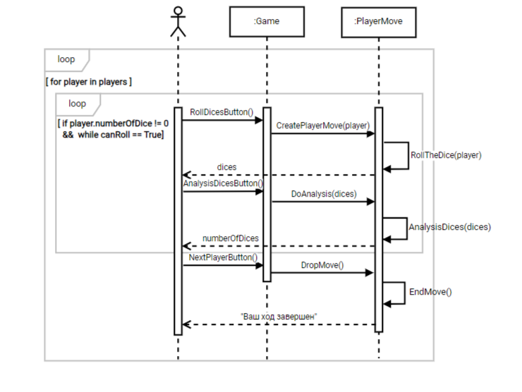
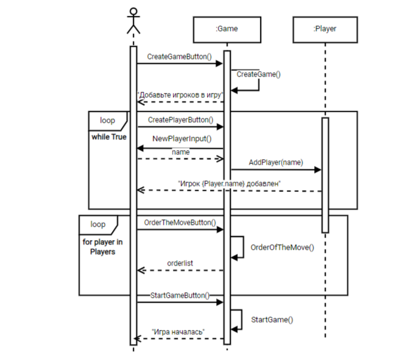
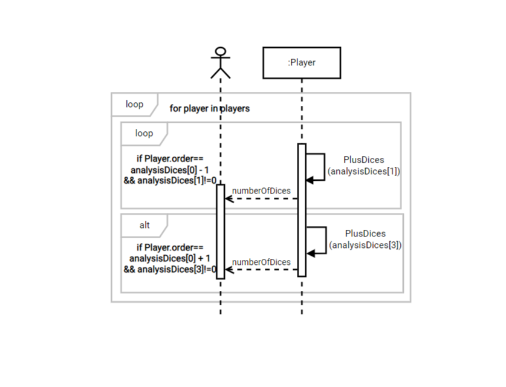
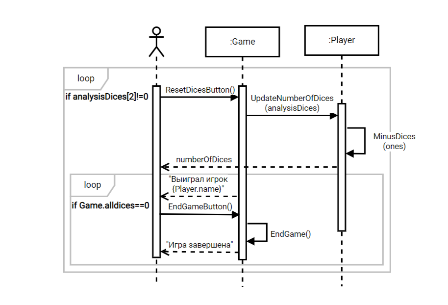
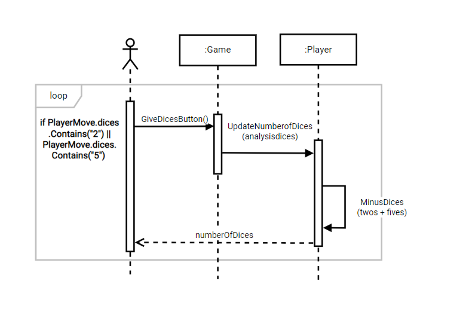

**Бросить кости**

|**Операция**|**RollDicesButton()**|
| :- | :- |
|Ссылки|Прецедент: Бросить кости|
|Предусловия|Нажата кнопка «Бросить кубики»|
|Постусловия|Отсутствует|

|**Операция**|**CreatePlayerMove(player)** |
| :- | :- |
|Ссылки|Прецедент: Бросить кости|
|Предусловия|Отсутствует|
|Постусловия|Создан объект класса PlayerMove|

|**Операция**|**RollTheDice(player) – происходит генереция значений на кубиках игрока**|
| :- | :- |
|Ссылки|Прецедент: Бросить кости|
|Предусловия|Наличие костей у игрока ( player.numberOfDice)|
|Постусловия|Обновлен список костей игрока (dices)|

|Операция|**AnylysisDicesButton()**|
| :- | :- |
|Ссылки|Прецедент: Бросить кости|
|Предусловия|Нажата кнопка «Проанализировать кости»|
|Постусловия|Отсутствует|

|**Операция**|**DoAnalysis(dices)**|
| :- | :- |
|Ссылки|Прецедент: Бросить кости|
|Предусловия|Отсутствует|
|Постусловия|Отсутствует|

|**Операция**|**AnylysisDices(dices) – происходит анализ выпавших костей. Возвращает массив [номер игрока, количество «2», количество «1», количество «5»]**|
| :- | :- |
|Ссылки|Прецедент: Бросить кости|
|Предусловия|Наличие комбинации из кубиков у игрока (dices)|
|Постусловия|Известно кол-во 1, 2 и 5 ( ones, twos, fives)|

|**Операция**|**NextPlayerButton()**|
| :- | :- |
|Ссылки|Прецедент: Бросить кости|
|Предусловия|Нажата кнопка «Следующий игрок»|
|Постусловия|Отсутствует|

|**Операция**|**DropMove()**|
| :- | :- |
|Ссылки|Прецедент: Бросить кости|
|Предусловия|Отсутствует|
|Постусловия|Отсутствует|

|**Операция**|**EndMove() – завершение хода игрока**|
| :- | :- |
|Ссылки|Прецедент: Бросить кости|
|Предусловия|Отсутствие в комбинации 1,2 и 5|
|Постусловия|Отсутствует|

**Войти в игру**

|**Операция**|**CreateGameButton()**|
| :- | :- |
|Ссылки|Прецедент: Войти в игру|
|Предусловия|Нажата кнопка «Создать игру»|
|Постусловия|Отсутствует|

|**Операция**|**CreateGame() – создает объект класса Game**|
| :- | :- |
|Ссылки|Прецедент: Войти в игру|
|Предусловия|Отсутствует|
|Постусловия|Создан объект класса Game|

|**Операция**|**CreatePlayerButton()**|
| :- | :- |
|Ссылки|Прецедент: Войти в игру|
|Предусловия|Нажать кнопка «Добавить игрока»|
|Постусловия|Отсутствует|

|**Операция**|**NewPlayerInput() – Система запрашивает ввод имени игрока**|
| :- | :- |
|Ссылки|Прецедент: Войти в игру|
|Предусловия|Игра запущена|
|Постусловия|Игрок ввел имя (name)|

|**Операция**|**AddPlayer(name) – создан объект класса Player**|
| :- | :- |
|Ссылки|Прецедент: Войти в игру|
|Предусловия|Создан объект класса Player|
|Постусловия|Игрок добавлен в игру |

|**Операция**|**OrderOftheMove() – определяется очередность хода игроков( игрок к наибольшей выброшенной суммой значений на костях становится первым и тд)**|
| :- | :- |
|Ссылки|Прецедент: Войти в игру|
|Предусловия|Наличие игроков в игре |
|Постусловия|Определена очередность хода для каждого игрока (order)|

|**Операция**|**StratGameButton()**|
| :- | :- |
|Ссылки|Прецедент: Войти в игру|
|Предусловия|Нажатие кнопки «Начать игру»|
|Постусловия|Отсутствует|

|**Операция**|**StartGame() – запускается игра с игроками, которые были введены**|
| :- | :- |
|Ссылки|Прецедент: Войти в игру|
|Предусловия|Определено кол-во игроков и очередность хода|
|Постусловия|Отсутствует|

**Получить кости от других игроков**

|**Операция**|**PlusDices(analysisDices[1]) – прибавляет к количеству костей игрока столько, столько выпало «2» у игрока, чей сейчас ход**|
| :- | :- |
|Ссылки|Прецедент: Получить кости от других игроков|
|Предусловия|analysisDices[1] не равен 0|
|Постусловия|Изменено количество костей у игрока|

|**Операция**|**PlusDices(analysisDices[3]) – прибавляет к количеству костей игрока столько, столько выпало «5» у игрока, чей сейчас ход**|
| :- | :- |
|Ссылки|Прецедент: Получить кости от других игроков|
|Предусловие|analysisDices[3] не равен 0|
|Постусловие|Изменено количество костей у игрока|

**Сбросить кости**

|**Операция**|**ResetDicesButton()**|
| :- | :- |
|Ссылки|Прецедент: Сбросить кости|
|Предусловия|Нажатие кнопки «Сбросить кости»|
|Постусловия|Отсутствие|

|**Операция**|**UpdateNumberOfDices(analysisDices) – разбивается analysisDices на соответствующие данные(кол-во двоек, единиц, пятерок), и они передаются в нужные методы для дальнейших действий**|
| :- | :- |
|Ссылки|Прецедент: Сбросить кости|
|Предусловия|Определен analysisDices|
|Постусловия|Разбит analysisDices|

|**Операция**|**MinusDices(number)  – вычитает из количества костей игрока, столько сколько передано**|
| :- | :- |
|Ссылки|Прецедент: Сбросить кости|
|Предусловия|Наличие «1» в комбинации игрока (analysisDices)|
|Постусловия|Изменение кол-ва костей у игрока|

|**Операция**|**EndGameButton()**|
| :- | :- |
|Ссылки|Прецедент: Сбросить кости|
|Предусловия|Нажата кнопка «Завершить игру»|
|Постусловия|Отсутствует|

|**Операция**|**EndGame() – завершение игры**|
| :- | :- |
|Ссылки|Прецедент: Сбросить кости|
|Предусловия|У всех игроков отсутствуют кости (allDices)|
|Постусловия|Отсутствует|

**Отдать кости другим игрокам**

|**Операция**|**GiveDicesButton()**|
| :- | :- |
|Ссылки|Прецедент: Отдать кости другим игрокам|
|Предусловия|Нажата кнопка «Отдать кости игрокам»|
|Постусловия|Отсутствует|

|**Операция**|**UpdateNumberofDices(analysisdices)**|
| :- | :- |
|Ссылки|Прецедент: Отдать кости другим игрокам|
|Предусловия|Отсутствует|
|Постусловия|Отсутствует|

|**Операция**|**MinusDices(twos+fives) – вычитает из количества костей игрока, столько сколько выпало «2» и «5»**|
| :- | :- |
|Ссылки|Прецедент: Отдать кости другим игрокам|
|Предусловия|Наличие в комбинации игрока «2» или «5»|
|Постусловия|Изменение кол-ва костей у игрока|

