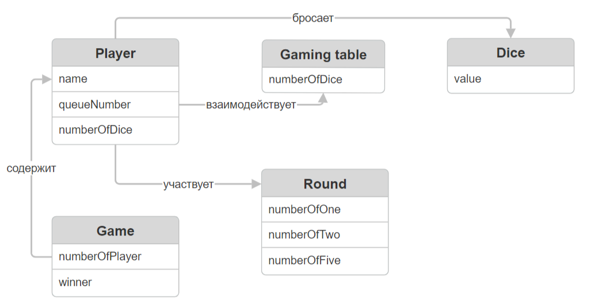

Игра(Game) содержит информации о количестве игроков и о том, кто является победителем в последней партии.

Игрок(Player) содержит информации об имени игрока, о количестве костей у игрока и о его номере в очередности ходов.

Игровой стол(Gaming table) содержит информации о количестве костей, которые игроки «сбросили».

Кубик(Dice) содержит информации о значение на кубике, которое выбросил Игрок.

Раунд(Round) содержит информации о количестве выпавших единиц, двоек и пятерок.

Связи:

1. Игрок УЧАСТВУЕТ в раунде
1. Игра СОДЕРЖИТ игроков
1. Игрок ВЗАИМОДЕЙТВУЕТ с игровым столом
1. Игрок БРОСАЕТ кости
